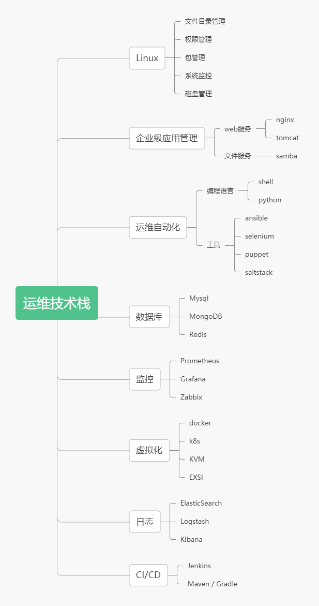

# 运维笔记
----
记录日常运维搬砖时的踩过的坑和应急的常规操作 /(ㄒoㄒ)/~~

----------
## 运维技术栈

----------

## 目录

### Linux

 - [centos](Linux/centos.md)
 - [watchdog](Linux/watchdog.md)

### Python

 - [Python](Python/Python.md)
 - [pip](Python/pip/pip.md)

###  Mysql

 - [Mysql](mysql/mysql.md)

### 三方件

 - [Prometheus](3rd_components/prometheus/prometheus.md)
   

